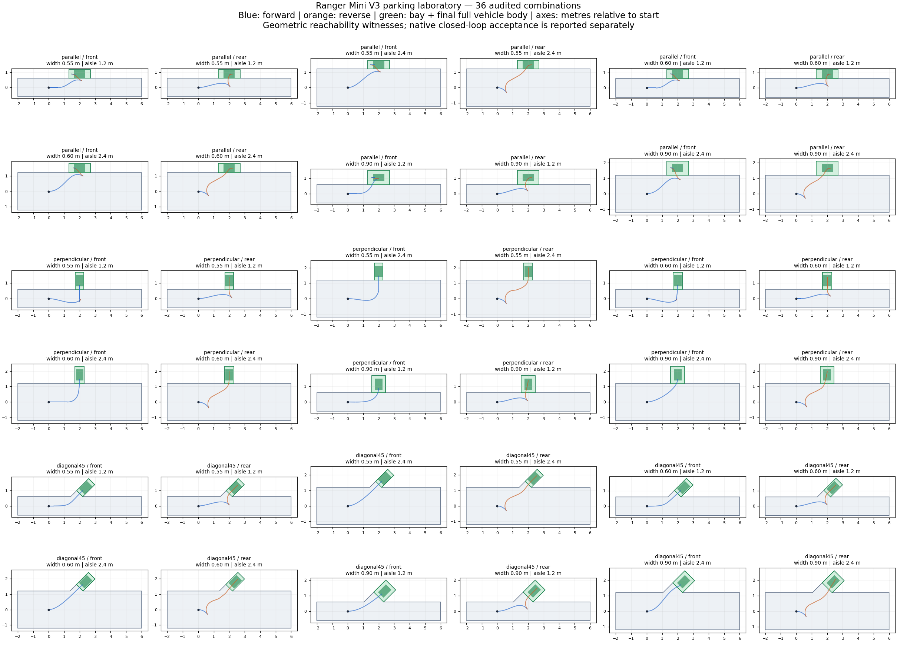

# 感知结果阶段：质量评测与泊车实验场

本轮继续使用 Ranger Mini V3 的感知目标列表、定位和 HDMap，不接入点云、图像。
网络仍是 V5；新增能力来自受几何约束的规划搜索，不能称为重新训练后的网络收益。
实验报告位于 `data/simulation/quality-parking-20261001/`，保留失败录包及各轮配置快照。
本轮结果汇总见 [QUALITY_PARKING_RESULTS.md](QUALITY_PARKING_RESULTS.md)。
后续泊入、泊出及连续任务的 138 场景集、指标和实测结果见 [PARKING_MISSIONS_V2.md](PARKING_MISSIONS_V2.md) 与 [PARKING_MISSIONS_V2_RESULTS.md](PARKING_MISSIONS_V2_RESULTS.md)。

## 指标接入

`simulator/result_analysis.py` 对 WorldSim 规划任务调用 `quality_metrics.py`。
结果随任务保存到 `analysis.json`，Web Monitor 的 Sim 任务详情 → **Full result analysis**
可查看 `quality_metrics`、`scenario_expectation`、`collision`、`planning_continuity`。
现有任务不会自动改写历史结论；复测任务使用新评测器。

| 维度 | 已记录的指标 | 判定方式 |
|---|---|---|
| 安全 | 原生真值 OBB 碰撞；完整车身越界；曲率/朝向连续性 | 碰撞、越界或运动学违规直接失败 |
| 任务 | 到达率、目标距离、路线进度、完成时间 | 到达且停车；无碰撞但卡住仍失败 |
| 效率 | 行驶距离、最长停车、≥10 s 停车次数、障碍消失后的恢复时间 | 测量，需结合场景预期解释 |
| 交互 | 最小车身间距、3 s 匀速 OBB TTC、TTC<1 s 暴露、会车间距、超车提前回正 | 诊断指标，不把不存在的交互计为通过 |
| 平顺性 | 纵向加速度、横向加速度、jerk、yaw rate 的 P95/最大值 | 测量；车辆舒适阈值尚未实车标定 |
| 算法 | 安全层修正比例、首帧耗时、规划耗时 P95/P99、超100 ms帧数 | 测量；首次泊车搜索与稳定执行分别解释 |
| 泊车 | 完整车身入位、朝向误差、中心误差、边界余量、换向次数、最终入库方向 | 后轴目标误差≤3 cm、朝向误差≤2°、速度<0.02 m/s、完整车身入位且方向符合预期 |
| 工程 | CUDA/内存耗尽分类 | `execution.failure_class=RESOURCE_EXHAUSTED`，行为未评估；不当作模型行为通过 |

普通到达要求距目标≤0.4 m且速度<0.05 m/s。永久阻塞场景仅能按有审计证据的
`safe_stop` 预期通过，不能事后把失败场景改成“应该停车”。场景侧车文件绑定 SHA256，
修改场景后必须重新审计。新增 `park` 预期还校验车位 ID、入库方向及目标姿态。

这是版本化工程验收 `closed-loop-v1`，不是 ISO 认证或公开榜单评分。
碰撞真值每10 ms检查；独立车身越界、运动学和舒适指标按录包约100 ms采样。
TTC 用当前速度/朝向外推，不是碰撞概率；无交互、无延迟数据等显示 `NOT_EVALUATED`。
终点最后不足100 ms的停车采样也保留，因此最大 jerk 会包含仿真停车决策的瞬时影响，
不能只看 P95 隐去峰值。`perfect_planning` 不代表 Control 或实车闭环通过。

## 有效场景与质量改进

`quality_scenarios.py` 从12个会车、nudge和组合场景生成24个扰动复测：
演员速度×0.85/1.15，纵向位置±0.3 m，保持车身尺寸和横向空间。
严格解析、起点车身在路内、初始无接触等是必要条件，原生完成是独立的行为验收。
场景及审计在 `scene_editor/examples/quality_regression_v1/`。

普通网络/空间候选全部停滞时，新增低速、仅前进的局部自行车模型搜索：
当前实际姿态 → 前方参考线，检查完整车身、地图边界和感知障碍；
候选再次经过原有动态障碍及制动安全检查。最多20000次展开、重试间隔2 s。
它不读取场景 ID、未来演员脚本，不改变道路或障碍尺寸。
静态障碍0.05 m、其他障碍0.12 m余量保持不变。
搜索节点额外预留5 mm，避免时间插值后略微切入上述安全距离；
`policy.csv.recovery_status` 记录未调用(0)、接受(1)、无路径(-1)、未通过后续检查(-2)。

## 泊车地图

地图：`data/map_data/ranger_parking_lab_v1/`，包含 base/sim/routing 的 bin 与 txt。
36个独立测试单元，每单元有8 m通道、车道/道路、ParkingSpace及lane overlap、Driveable区域。
各单元相隔15 m；这是专项实验地图，尚未做成连通的真实停车场路网。
45°车位入口包含全宽斜向接入区域，防止入口三角形把本来可达的车位夹窄。

| 参数 | 取值 |
|---|---|
| 车辆长×宽 | 0.72×0.50 m，后轴定位点前0.62 m、后0.10 m |
| 形式 | 平行、垂直、45°斜列 |
| 车位宽 | 0.55 m（每侧2.5 cm）、0.60 m（每侧5 cm）、0.90 m |
| 车位长 | 平行1.40 m；垂直/斜列1.10 m |
| 通道宽 | 1.20 m、2.40 m |
| 入库 | 车头、车尾；允许中途前后调整，检查最后运动方向 |
| 组合 | 3×3×2×2 = 36 |

宽度均垂直于车位长轴测量。车辆中心与后轴定位点相差0.26 m，目标计算及
验收分别处理，不能仅用定位点在车位内判断成功。
车位线的规划内缩为8 mm，是几何实验余量；不同于普通行驶中的障碍物安全距离。
0.55 m车位只有2.5 cm单侧余量，本轮没有定位噪声或控制跟踪误差。



蓝线前进、橙线后退；图片是运动学可达性证据，不冒充实际执行轨迹。
`parking_project.py --probe /tmp/parking_probe` 先生成几何路径，Shapely独立检查完整车身、
运动学连续性，生成 `.witness.json` 和绑定场景哈希的 `.evaluation.json`。
找不到路径标记 `UNPROVEN`，不能据此声称车位物理上不可达。

泊车使用独立可逆运动学搜索及加减速时间参数化，最高0.20 m/s。
换向前先停车，禁止跨换向边界拼接跳跃轨迹；拒绝 Hermite 连接中隐藏的朝向翻转。
每帧重新检查当前感知的静态障碍。当前遇到移动障碍、跟踪偏离或中途停车/清除命令
明确报错退出，不支持动态绕障或暂停恢复；不能作为开放环境自动泊车发布。
最困难测试的首次路径搜索约32.6 s，实时规划性能仍需优化。

## Dreamview Plus 下发路径

当前有效入口是 WebSocket `SendRoutingRequest`，请求包含 `data.requestId` 和
`data.info.end.{x,y}`。后端用 `GetParkingSpaceId` 判断终点是否位于车位；命中后创建
`ValetParkingCommand`，设置 `command_id` 与 `parking_spot_id` 并经 service 发送。
旧的 `SendParkingRoutingRequest` 注册代码已注释，不能作为当前有效接口使用。

源码入口：

- `modules/dreamview_plus/backend/simulation_world/simulation_world_updater.cc`：请求识别、`ConstructValetParkingCommand`。
- `modules/dreamview_plus/backend/simulation_world/simulation_world_service.cc`：`PublishValetParkingCommand`。
- `modules/external_command/command_processor/valet_parking_command_processor/`：路线转换及 `PlanningCommand.parking_command.parking_spot_id`。

本轮 WorldSim 在真实 Routing 响应后，把场景 `ego.parkingSpaceId` 填入同一
下游 PlanningCommand 字段，由 ML Planning 读取 HDMap 车位。
这验证了 WorldSim → Routing → PlanningCommand → ML Planning → 车辆 → 完成/评测，
尚未启动 Dreamview WebSocket/external-command 服务做完整端到端验收。
协议本身没有“车头/车尾入库”字段；本地图用不同车位的目标 heading 表达最终车身朝向，
规划器结合相邻通道推导最终入库方向，平行位使用车道朝向约定。

## 复现

在 Apollo 容器 `/apollo_workspace` 中：

地图产物在 `data/`，如需从源码重新生成地图、场景、可达性证据及布局图：

```bash
g++ -std=c++17 -O2 -I. modules/simulation/ml_planning/parking_probe.cc -o /tmp/parking_probe
python3 modules/simulation/ml_planning/parking_project.py --probe /tmp/parking_probe
/opt/apollo/neo/bin/topo_creator \
  --map_dir=/apollo_workspace/data/map_data/ranger_parking_lab_v1 \
  --routing_conf_file=/opt/apollo/neo/share/modules/routing/conf/routing_config.pb.txt
python3 modules/simulation/ml_planning/plot_parking_project.py
```

编译与原生复测：

```bash
buildtool build -p modules/simulation --cpu -j 6
cd modules/simulation/simulator
python3 -m unittest test_quality_metrics test_driving_quality test_task_service test_scenario_evaluation
python3 run_quality_regression.py \
  --suite ../scene_editor/examples/parking_lab/parking-lab.suite.json \
  --state-dir /apollo_workspace/data/simulation/parking-retest --workers 2
python3 run_quality_regression.py \
  --suite ../scene_editor/examples/quality_regression_v1/quality-regression.suite.json \
  --state-dir /apollo_workspace/data/simulation/interaction-retest --workers 2
```

评测 Python 依赖见 `simulator/requirements.txt`；当前容器已验证 numpy 2.1.3、shapely 2.0.6。
规划只选 `ML_PLANNING + ROUTING`，车辆 Ranger Mini V3，模型 `perfect_planning`。
本轮不需要启动带 CUDA 预测网络的 PREDICTION；各批并发2，避免之前30路预测挤占显存。
Web Monitor 可直接选择上述两套 suite；看指标需展开 Full result analysis。

后续提高网络本身质量，应把停滞/高干预失败录包转换成新训练课程，冻结本批验收集，
再用未参与训练的速度、起点、地图扰动评估新权重。泊车先补动态障碍停车恢复、
搜索耗时优化和带控制/定位误差的闭环，再考虑模仿可行轨迹训练可逆策略。
