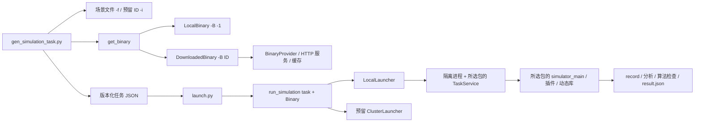

# 按 Binary 选择仿真运行环境

`gen_simulation_task.py` 负责解析场景和 binary，向 stdout 写一个任务 JSON；
`launch.py` 读取任务，重建 `Binary` 对象，再调用
`run_simulation(task, binary, backend='local')`。下载进度、执行状态和错误写到 stderr，
因此两条命令可以直接通过管道连接。



## 在容器内运行

先按打包说明重新生成 binary.tar.gz。解压新的 binary 包后，source 包内环境即可发现两个命令。当前使用 `-f` 指定场景，
`-i` 尚未连接场景服务，会明确报错。

```bash
tar -xzf binary.tar.gz
source binary/setup.bash
set -o pipefail

gen_simulation_task.py -B -1 \
  -f data/scenarios/ranger_mini_v3_1haolou_smoke.scenario.json \
  --repeat 2 | launch.py -c local

gen_simulation_task.py -B -1 \
  -f data/scenarios/ranger_mini_v3_1haolou_smoke.scenario.json \
  --planner ml --repeat 2 | launch.py -c local
```

标准 PNC 默认运行 Prediction / Planning / Control / Routing，模型为
`kinematic_control`。ML 默认运行 ML Planning / Routing，模型为
`perfect_planning`；这是理想轨迹跟随的 ML 仿真。可以用 `--modules` 和 `--model`
显式选择组合，最终配置由所选包的 TaskService 校验。

静态障碍示例没有声明 vehicleProfile，运行时需显式提供：

```bash
gen_simulation_task.py -B -1 \
  -f modules/simulation/ml_planning/examples/1haolou/straight_centered.worldsim.scenario.json \
  --profile "$APOLLO_DISTRIBUTION_HOME/profiles/ranger_mini_v3" \
  --planner ml --repeat 2 | launch.py -c local
```

本地 binary 选择顺序：`--local-binary`、`SIMULATION_LOCAL_BINARY`、已 source 的
`APOLLO_DISTRIBUTION_HOME`，最后是 CLI 所在工作区的 `binary/` 或 `binary.tar.gz`。
这里的 binary 是含 format 4 manifest 的可移植包。开发环境的 `/opt/neo`、Bazel
产物目录不能直接替代这个运行包；在开发容器中可这样显式选择：

```bash
source /apollo_workspace/modules/simulation/setup.bash
gen_simulation_task.py -B -1 --local-binary /apollo_workspace/binary.tar.gz \
  -f /apollo_workspace/data/scenarios/ranger_mini_v3_1haolou_smoke.scenario.json \
  --repeat 2 | launch.py -c local
```

场景中的 `mapId`、`ego.vehicleProfile` 默认从所选 binary 中寻找。
若包内没有这些数据，再从 CLI 工作区寻找；也可以显式传入 `--map-dir`、`--profile`。
地图必须有 base_map 和 sim_map，profile 必须有车辆参数。数据搜索不参与动态库选择。
本地目录不会自动校验全部文件，生成和启动会核对 manifest/native binary 指纹；
本地压缩包和下载包在解压与缓存命中时校验全部 SHA256SUMS。

## 最简单的 Binary ID 服务

在一台能被执行容器访问的机器上启动服务。脚本位于源码仓库中，服务只暴露一个指定包：

```bash
python3 /apollo_workspace/modules/simulation/tools/execution/mock_binary_service.py \
  --binary-id 123143 --archive /apollo_workspace/binary-all.tar.gz \
  --host 0.0.0.0 --port 8088
```

另一个终端中执行。服务在同一个容器时可以使用 127.0.0.1，跨容器时替换为实际地址：

```bash
source /path/to/binary/setup.bash
export BINARY_SERVICE_URL=http://127.0.0.1:8088
export SIMULATION_BINARY_CACHE=/path/to/writable/binary-cache
set -o pipefail
gen_simulation_task.py -B 123143 \
  -f data/scenarios/ranger_mini_v3_1haolou_smoke.scenario.json \
  --repeat 2 | launch.py -c local
```

每次解析 ID 都查询元数据，同一 ID、同一 archive SHA 的包只下载一次。
默认缓存位于 `~/.cache/apollo_simulation/binaries/<ID>/<SHA>/binary`；也可传
`--binary-cache` 或 `SIMULATION_BINARY_CACHE`。下载用 ID 锁串行化，先完整校验再原子发布，
解压拒绝包外路径、链接、特殊文件。未知 ID、坏包和坏缓存会返回错误，
不会改用本地 binary。缓存目录必须可写。

替换服务时保持以下最小接口即可：

```http
GET /binaries/123143
```

```json
{
  "id": "123143",
  "archive_url": "/archives/123143/binary.tar.gz",
  "sha256": "压缩包的64位小写SHA256",
  "size_bytes": 3926070719
}
```

`archive_url` 支持相对 URL 或 HTTP(S) 绝对 URL，响应内容是正常的 `binary.tar.gz`。
mock 服务额外提供 `/stats`，供验收确认本地 binary 不下载、ID binary 使用缓存。

## 对象和扩展位置

| 文件 / 类型 | 职责 |
| --- | --- |
| `binary.py` / `Binary` | binary ID、绝对路径、native 可执行路径、指纹、独立环境 |
| `LocalBinary` / `DownloadedBinary` | 来源类型；任务反序列化后仍保持对应类型 |
| `BinaryProvider.resolve()` | 将 ID 转为下载 URL、SHA-256、大小；可替换为正式服务 |
| `get_binary()` | 选择本地包，或查询、下载、缓存并返回 Binary |
| `task.py` / `SimulationTask` | 协议/版本、输入摘要、Binary 描述、仿真配置 |
| `task.py` / `get_scenario()` | 当前解析文件；后续接入场景 ID 服务 |
| `launcher.py` / `run_simulation()` | 接收明确的 Binary 对象、检查指纹、分派运行后端 |
| `LocalLauncher` | 单独的 worker 进程、日志、总超时、Ctrl-C 清理 |
| `worker.py` | 加载所选包的 TaskService 和其同目录辅助模块，冻结输入，执行和检查 |
| `checks.py` | 原生录包、模块输出、重复一致性、算法健康、场景质量及 ML 推理检查 |

`Binary.environment()` 从镜像基础环境开始 source 所选包的 setup，避免继承之前
binary 的 LD_LIBRARY_PATH、PYTHONPATH、LD_PRELOAD。worker 使用所选包的
TaskService、schema、simulator_main、配置和库；控制 CLI 可以来自另一个版本。
目前要求所选包兼容 TaskService 的现有接口和 format 4 布局。

新增线上后端时实现 `Launcher.check_available()` / `run()` 并加入 `LAUNCHERS`。
`-c cluster` 目前显式报未配置，不会在本地悄悄执行。集群适配器还需要在远端根据
ID/SHA 解析 binary、上传或解析场景数据，并返回结果；本地路径只适用于 local 后端。
场景 ID 接入位置为 `get_scenario()`，当前 `-i` 报错发生在 binary 下载之前。

任务协议为 `apollo.simulation.task`、version 1。可先生成任务再启动：

```bash
gen_simulation_task.py -B -1 -f /path/to/scene.json > task.json
launch.py -c local --task-file task.json --output-root /path/to/results
```

生成和启动必须在同一文件系统中进行；输入或 binary 指纹变化后任务被拒绝。
每次运行使用独立目录，保存 `task.json`、`launch.log`、`result.json` 以及 TaskService 的
冻结配置、manifest、原始录包和分析。stdout 的最终 JSON 包含实际 binary 路径和指纹、
record 路径、检查结果。超时保留 TIMEOUT，Ctrl-C 保留 CANCELLED 并返回 130。

重复次数默认 1，此时 determinism 为 NOT_TESTED；`--repeat 2` 才会实际检查。
规划必须有健康轨迹，Control 仅允许初始 100 ms 等待首个轨迹的已知状态 1002，
后续错误拒绝通过并保留健康报告。ML 还使用实际观测和冻结权重做独立推理比较。

## 回归与真实验收

```bash
python3 -m unittest discover -s modules/simulation/tools/execution/tests -p 'test_*.py' -v

# 在干净 Apollo 镜像内；仅传入两个实际包及验收脚本。
python3 native_pipeline.py \
  --local-binary /tmp/binary-selection/binary \
  --remote-archive /tmp/remote-binary.tar.gz \
  --service-script /tmp/mock_binary_service.py \
  --output /tmp/binary-selection/acceptance
```

`tests/native_pipeline.py` 是显式执行的原生验收，不属于小型单元测试。
它 source 新包中的 CLI，分别使用本地 CPU binary 和 ID 服务下载的全量 binary，
各跑 PNC、ML 无障碍、ML 静态避障并重复两次；验证选中的 native binary 不同，
库均来自选中目录，实际录包及分析通过，下载仅一次。验收记录见
[2026-10-07 验收摘要](VALIDATION.md)。

`tests/native_replay.py` 可继续使用打包验收器的回放检查，验证上述 CLI 输出录包的
MCAP 转换、话题解码和 gRPC 回放；本轮六个任务均通过。它通过服务 API 运行验收。
